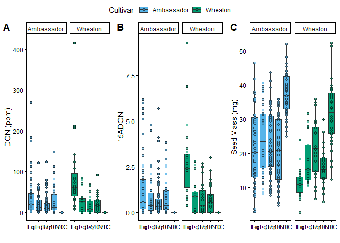
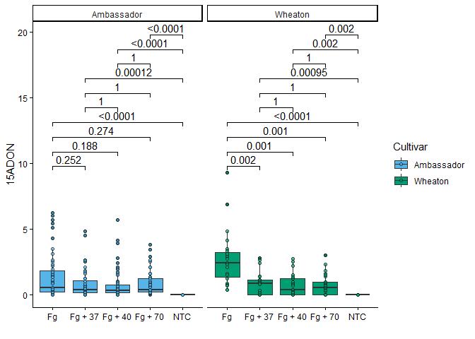
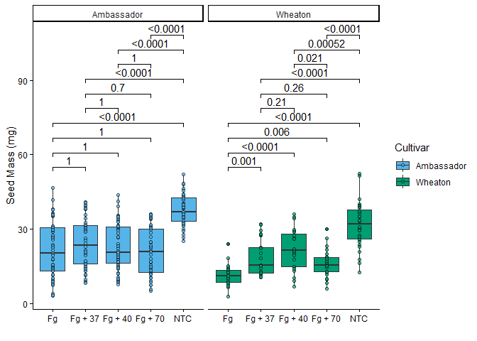

# Question

*In the context of R Markdown , the YAML header appears at the top of
the document, enclosed by — lines, and it contains metadata about the
document.* *Literate Programming(For eg. R Markdown) is documentation
and code live together in the same file, making it easy for others (and
your future self!) to understand not just what the code does, but why it
was written that way.*

# Question2a

\-[PaperLink](https://apsjournals.apsnet.org/doi/10.1094/PDIS-06-21-1253-RE)

# Question2b

``` r
library(tidyverse)
```

    ## Warning: package 'tidyverse' was built under R version 4.4.3

    ## Warning: package 'ggplot2' was built under R version 4.4.3

    ## ── Attaching core tidyverse packages ──────────────────────── tidyverse 2.0.0 ──
    ## ✔ dplyr     1.1.4     ✔ readr     2.1.5
    ## ✔ forcats   1.0.0     ✔ stringr   1.5.1
    ## ✔ ggplot2   4.0.2     ✔ tibble    3.2.1
    ## ✔ lubridate 1.9.4     ✔ tidyr     1.3.1
    ## ✔ purrr     1.0.2     
    ## ── Conflicts ────────────────────────────────────────── tidyverse_conflicts() ──
    ## ✖ dplyr::filter() masks stats::filter()
    ## ✖ dplyr::lag()    masks stats::lag()
    ## ℹ Use the conflicted package (<http://conflicted.r-lib.org/>) to force all conflicts to become errors

``` r
library(ggplot2)
library(ggpubr) 
```

    ## Warning: package 'ggpubr' was built under R version 4.4.3

``` r
mycotoxin<- read.csv(file.choose())
mycotoxin$Treatment <- as.factor(mycotoxin$Treatment) 
mycotoxin$Cultivar <- as.factor(mycotoxin$Cultivar)
mycotoxin$DON <- as.numeric(mycotoxin$DON)
```

    ## Warning: NAs introduced by coercion

``` r
mycotoxin$X15ADON <- as.numeric(mycotoxin$X15ADON)
```

    ## Warning: NAs introduced by coercion

``` r
mycotoxin$MassperSeed_mg <- as.numeric(mycotoxin$MassperSeed_mg)
```

    ## Warning: NAs introduced by coercion

``` r
str(mycotoxin)
```

    ## 'data.frame':    375 obs. of  6 variables:
    ##  $ Treatment     : Factor w/ 5 levels "Fg","Fg + 37",..: 1 1 1 1 1 1 1 1 1 1 ...
    ##  $ Cultivar      : Factor w/ 2 levels "Ambassador","Wheaton": 2 2 2 2 2 2 2 2 2 2 ...
    ##  $ BioRep        : int  2 2 2 2 2 2 2 2 2 3 ...
    ##  $ MassperSeed_mg: num  10.29 12.8 2.85 6.5 10.18 ...
    ##  $ DON           : num  107.3 32.6 416 211.9 124 ...
    ##  $ X15ADON       : num  3 0.85 3.5 3.1 4.8 3.3 6.9 2.9 2.1 0.71 ...

# Question2c

``` r
cbbPalette <- c("#56B4E9", "#009E73")
```

# DON_PLOT1

``` r
Plot1 <- ggplot(mycotoxin, aes(x = Treatment, y = DON, fill = Cultivar)) + 
  geom_boxplot(position = position_dodge(0.85)) + 
  xlab("") +  
  ylab("DON (ppm)") + 
  geom_point(alpha = 0.6,pch = 21, color = "black") + 
  scale_fill_manual(values = cbbPalette)+ 
  facet_wrap(~Cultivar)+  
  theme_classic() 
Plot1
```

    ## Warning: Removed 8 rows containing non-finite outside the scale range
    ## (`stat_boxplot()`).

    ## Warning: Removed 8 rows containing missing values or values outside the scale range
    ## (`geom_point()`).

<!-- -->

# Plot X15ADON

``` r
Plot2 <- ggplot(mycotoxin, aes(x = Treatment, y = X15ADON, fill = Cultivar)) + 
  geom_boxplot(position = position_dodge(0.85)) +  
  xlab("") +  
  ylab("15ADON") +  
  geom_point(alpha = 0.6,pch = 21, color = "black") + 
  scale_fill_manual(values = cbbPalette)+ 
  facet_wrap(~Cultivar)+ 
  theme_classic() 
Plot2
```

    ## Warning: Removed 10 rows containing non-finite outside the scale range
    ## (`stat_boxplot()`).

    ## Warning: Removed 10 rows containing missing values or values outside the scale range
    ## (`geom_point()`).

<!-- -->

# SeedMass

``` r
#Plot 3

Plot3<- ggplot(mycotoxin, aes(x = Treatment, y = MassperSeed_mg, fill = Cultivar)) + 
geom_boxplot(position = position_dodge(0.85)) +  
  xlab("") +  
  ylab("Seed Mass (mg)") +  
  geom_point(alpha = 0.6,pch = 21, color = "black") + 
  scale_fill_manual(values = cbbPalette)+ 
  facet_wrap(~Cultivar)+ 
  theme_classic() 
Plot3
```

    ## Warning: Removed 2 rows containing non-finite outside the scale range
    ## (`stat_boxplot()`).

    ## Warning: Removed 2 rows containing missing values or values outside the scale range
    ## (`geom_point()`).

<!-- -->

\#3Combined_PLOT

``` r
library(ggpubr)


figure=ggarrange(
  Plot1,
  Plot2,
  Plot3,
  labels = c("A", "B", "C"),
  nrow = 1,
  ncol = 3,
  common.legend=TRUE
)
```

    ## Warning: Removed 8 rows containing non-finite outside the scale range
    ## (`stat_boxplot()`).

    ## Warning: Removed 8 rows containing missing values or values outside the scale range
    ## (`geom_point()`).

    ## Warning: Removed 8 rows containing non-finite outside the scale range
    ## (`stat_boxplot()`).

    ## Warning: Removed 8 rows containing missing values or values outside the scale range
    ## (`geom_point()`).

    ## Warning: Removed 10 rows containing non-finite outside the scale range
    ## (`stat_boxplot()`).

    ## Warning: Removed 10 rows containing missing values or values outside the scale range
    ## (`geom_point()`).

    ## Warning: Removed 2 rows containing non-finite outside the scale range
    ## (`stat_boxplot()`).

    ## Warning: Removed 2 rows containing missing values or values outside the scale range
    ## (`geom_point()`).

``` r
figure
```

<!-- -->
\#Combined_with_pairwisecomparison

``` r
## Plot 1: plot1 with pairwise comparisons 
Plot1_pwc <- Plot1 +
  geom_pwc(aes(group = Treatment), method = "t.test", label = "p.adj.format") +  # Add pairwise t-tests
  theme_classic()

Plot1_pwc
```

    ## Warning: Removed 8 rows containing non-finite outside the scale range
    ## (`stat_boxplot()`).

    ## Warning: Removed 8 rows containing non-finite outside the scale range
    ## (`stat_pwc()`).

    ## Warning: Removed 8 rows containing missing values or values outside the scale range
    ## (`geom_point()`).

<!-- -->

``` r
##Plot 2: plot2 with pairwise comparisons
Plot2_pwc <- Plot2 +
  geom_pwc(aes(group=Treatment), method= "t.test", label= "p.adj.format")+
  theme_classic()

Plot2_pwc
```

    ## Warning: Removed 10 rows containing non-finite outside the scale range
    ## (`stat_boxplot()`).

    ## Warning: Removed 10 rows containing non-finite outside the scale range
    ## (`stat_pwc()`).

    ## Warning: Removed 10 rows containing missing values or values outside the scale range
    ## (`geom_point()`).

<!-- -->

``` r
##Plot 3: plot3 with pairwise comparisons
Plot3_pwc = Plot3 + geom_pwc(aes(group=Treatment), method="t.test", label="p.adj.format")+
  theme_classic()

Plot3_pwc
```

    ## Warning: Removed 2 rows containing non-finite outside the scale range
    ## (`stat_boxplot()`).

    ## Warning: Removed 2 rows containing non-finite outside the scale range
    ## (`stat_pwc()`).

    ## Warning: Removed 2 rows containing missing values or values outside the scale range
    ## (`geom_point()`).

<!-- -->

``` r
#Combine all three plots with a common legend ----
Combined_pwc =ggarrange(
  Plot1_pwc,
  Plot2_pwc,
  Plot3_pwc,
  labels = c("D", "E", "F"),
  nrow = 1,
  ncol = 3,
  common.legend=TRUE
)
```

    ## Warning: Removed 8 rows containing non-finite outside the scale range
    ## (`stat_boxplot()`).

    ## Warning: Removed 8 rows containing non-finite outside the scale range
    ## (`stat_pwc()`).

    ## Warning: Removed 8 rows containing missing values or values outside the scale range
    ## (`geom_point()`).

    ## Warning: Removed 8 rows containing non-finite outside the scale range
    ## (`stat_boxplot()`).

    ## Warning: Removed 8 rows containing non-finite outside the scale range
    ## (`stat_pwc()`).

    ## Warning: Removed 8 rows containing missing values or values outside the scale range
    ## (`geom_point()`).

    ## Warning: Removed 10 rows containing non-finite outside the scale range
    ## (`stat_boxplot()`).

    ## Warning: Removed 10 rows containing non-finite outside the scale range
    ## (`stat_pwc()`).

    ## Warning: Removed 10 rows containing missing values or values outside the scale range
    ## (`geom_point()`).

    ## Warning: Removed 2 rows containing non-finite outside the scale range
    ## (`stat_boxplot()`).

    ## Warning: Removed 2 rows containing non-finite outside the scale range
    ## (`stat_pwc()`).

    ## Warning: Removed 2 rows containing missing values or values outside the scale range
    ## (`geom_point()`).

``` r
Combined_pwc
```

<!-- -->

# Question5

[README](%22CodingChallenge4_Classwork.md%22)

# Question6

[Github](https://github.com/GayatriBhandari/Reproducibility-GB.git)
